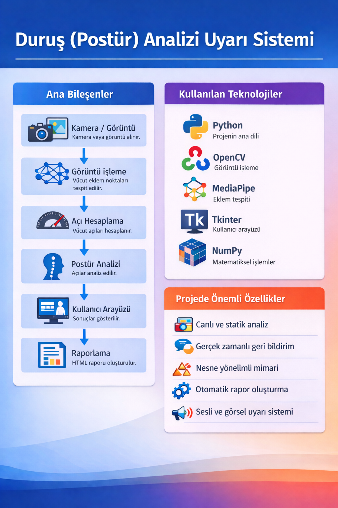

# DURUŞ (POSTÜR) ANALİZİ VE UYARI SİSTEMİ

**Ders:** BOZ213 – Nesne Yönelimli Programlama (OOP)  
**Proje Türü:** Final Projesi  
**Geliştirici:** Tuna Özdeş  
**Üniversite:** Ankara Üniversitesi  
**Durum:** Tamamlandı (v1.0)

---

## 📖 Proje Hakkında
Bu proje, kamera veya statik görüntüler üzerinden insan duruşunu (postür) analiz eden ve
omuz, boyun, yüz ve omurga açılarını hesaplayarak kullanıcıya görsel ve sayısal geri bildirim
sunan bir postür analiz sistemidir. Sistem, MediaPipe tabanlı iskelet (landmark) tespiti ve
OpenCV destekli görüntü işleme teknikleri kullanılarak geliştirilmiştir.

Proje, Nesne Yönelimli Programlama (OOP) prensipleri esas alınarak modüler, okunabilir ve
genişletilebilir bir mimariyle tasarlanmıştır.

---

## 🧩 Temel Özellikler

- **Canlı ve Statik Analiz:** Kamera veya tekil görüntü üzerinden postür analizi  
- **Gerçek Zamanlı Geri Bildirim:** Açı, seviye ve uyarıların anlık gösterimi  
- **İskelet Tabanlı Modelleme:** MediaPipe ile eklem (landmark) tespiti  
- **Otomatik Raporlama:** HTML tabanlı analiz raporu üretimi  
- **Nesne Yönelimli Mimari:** Modüler, okunabilir ve genişletilebilir yapı 

---

## 🛠️ Kullanılan Teknolojiler

Proje, Python 3.10+ kullanımını sağlar. Aşağıdaki temel kütüphanelerden yararlanılmıştır:

| Kütüphane | Kullanım Amacı |
|----------------------|----------|
| **OpenCV** | Görüntü alma, kare işleme ve çizim işlemleri |
| **MediaPipe** | İnsan vücudu eklem (pose landmark) tespiti |
| **NumPy** | Matematiksel hesaplamalar ve açı analizleri |
| **Tkinter** | Grafiksel kullanıcı arayüzü (GUI) |
| **Pillow** | Türkçe karakter destekli metin çizimi |

---

## 📁 Proje Dosya Yapısı
```
TUNA_OZDES_FINAL_PROJE/
│
├── analiz_modu.py
├── arayuz_ozellikleri.py
├── canli_analiz.py
├── goruntu_isleme.py
├── kamera_modulu.py
├── raporlama.py
├── main.py
│
├── Raporlar/
│   └── (Oluşturulan HTML raporlar)
│
├── infografik.png
├── README.md
├── proje_mimarisi.md
├── pair_programming.md
└── ai_usage.md
```

---

## ⚙️ Kurulum ve Çalıştırma

Projeyi çalıştırmak için aşağıdaki adımları izleyin.

### 1. Repoyu Klonlayın

```bash
git clone https://github.com/TUNAOZDES/BOZ213-FINAL-DURUS-POSTUR-ANALIZI-UYARI-SISTEMI.git
cd BOZ213-FINAL-DURUS-POSTUR-ANALIZI-UYARI-SISTEMI
```

### 2. Sanal Ortam Oluşturun (Önerilen)

**Windows**
```bash
python -m venv venv
venv\Scripts\activate
```

**Mac / Linux**
```bash
python3 -m venv venv
source venv/bin/activate
```

> ⚠️ Windows PowerShell için gerekirse:
> `Set-ExecutionPolicy -ExecutionPolicy RemoteSigned -Scope Process`

### 3. Gerekli Kütüphaneleri Yükleyin

```bash
pip install opencv-python mediapipe numpy pillow reportlab
```
Not: Tkinter Python ile birlikte gelmektedir, ayrıca kurulmasına gerek yoktur.

### 4. Uygulamayı Çalıştırın

```bash
python main.py
```

> ℹ️ İlk çalıştırmada MediaPipe modelleri otomatik olarak indirilecektir.

---

## ▶️ Kullanım

- Canlı Analiz: Kamera üzerinden gerçek zamanlı postür analizi  
- Statik Analiz: Seçilen tek bir görüntü dosyası üzerinden analiz  

Analiz sonunda:
- Açı değerleri hesaplanır  
- Duruş puanı oluşturulur  
- HTML formatında rapor üretilir 

---

## 🏗️ Yazılım Mimarisi ve OOP Prensipleri

Bu proje, **Temiz Kod (Clean Code)** prensipleri ve **Nesne Yönelimli Programlama (OOP)** kurallarına uygun olarak
tasarlanmıştır. Her bileşen, tek bir sorumluluğa sahip olacak şekilde ayrıştırılmıştır.

### 1. Sınıflar ve Sorumluluklar

- **MainWindow (Tkinter)**  
  Kullanıcı arayüzünü yönetir. Kullanıcı etkileşimleri, butonlar ve analiz başlatma işlemleri bu sınıf üzerinden yürütülür.

- **KameraYoneticisi**  
  Kameranın başlatılması, kare okunması ve serbest bırakılması işlemlerinden sorumludur.

- **AnalizModu (Abstract Class)**  
  Canlı analiz ve statik analiz için ortak arayüz tanımlar.

- **CanliAnaliz**  
  Gerçek zamanlı kamera görüntüsü üzerinden postür analizini yürütür.

- **RaporYoneticisi**  
  Analiz sonuçlarını saklar ve HTML formatında rapor üretir.

### 2. Kullanılan OOP Prensipleri

- **Kalıtım (Inheritance)**  
  `CanliAnaliz` sınıfı, `AnalizModu` soyut sınıfından türetilmiştir.

- **Soyutlama (Abstraction)**  
  Analiz türleri, ortak bir soyut yapı altında tanımlanmıştır.

- **Kapsülleme (Encapsulation)**  
  Kritik veriler (`veriler`, `kamera`, `hesaplayici`) sınıf içinde tutulur, doğrudan erişim engellenir.

- **Çok Biçimlilik (Polymorphism)**  
  Kullanıcının seçtiği analiz türüne göre aynı kontrol yapısı altında farklı çalışma senaryoları yürütülür.

### 3. Veri Yapıları ve Algoritmalar

- **Dictionary (Sözlük)**  
  MediaPipe landmark verileri ID–koordinat eşleşmesi şeklinde saklanır.

- **List (Liste)**  
  Analiz boyunca elde edilen puanlar ve seviyeler sıralı şekilde tutulur.

- **Algoritmalar**  
  Açı hesaplama, eşik kontrolü ve ceza puanı üretimi matematiksel algoritmalarla gerçekleştirilir.

---

## 🧠 Pair Programming ve Yapay Zeka Asistanı Kullanımı

Bu proje, pair programming yaklaşımı benimsenerek geliştirilmiştir.
Geliştirme sürecinde öğrenci ve yapay zeka asistanı birlikte çalışmıştır.

- Proje mimarisi ve modüler yapı birlikte planlanmıştır
- Kod düzenleme, hata ayıklama ve iyileştirme süreçlerinde yapay zeka aktif olarak kullanılmıştır
- Akademik değerlendirme kriterlerine uygunluk sürekli kontrol edilmiştir

Bu sürece ait detaylı açıklamalar aşağıdaki dosyalarda yer almaktadır:
- pair_programming.md
- ai_usage.md
- proje_mimarisi.md

---

## 📌 Sistem Mimarisi ve İşleyiş

Aşağıdaki infografik, sistemin veri girişinden rapor çıktısına kadar olan genel mimarisini ve işlem adımlarını özetlemektedir.



---

## 📄 Lisans ve Telif Hakkı

Bu projede **Tüm Haklar Saklıdır**.

Kaynak kodları yalnızca inceleme ve eğitim amaçlı erişime sahiptir. İzin alınmasından ticari amaçla kullanılması, kopyalanması veya dağıtılması yasaktır.

**Copyright © 2026 Tuna Özdeş**

_Not: Bu proje Ankara Üniversitesi BOZ213 dersi kapsamında geliştirilmiştir._


